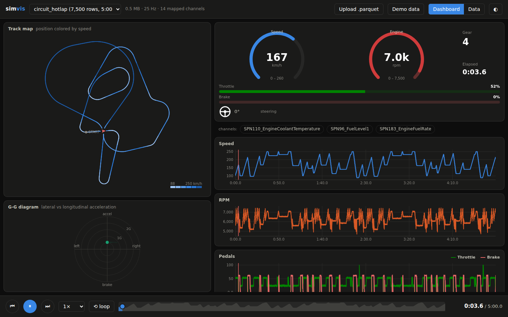

# simvis — Parquet 車両データ再生・可視化プラットフォーム

Parquet 形式の車両ログ（実車・シミュレータ・CAN ダンプなど）を読み込み、
**走行の再生（プレイバック）とリアルタイム可視化**を行う統合プラットフォームです。



## 特長

- **SAE J1939 準拠のシグナル体系** — SPN（Suspect Parameter Number）辞書を内蔵し、
  `SPN84_WheelBasedVehicleSpeed`・`spn_190`・`SteeringWheelAngle` のような
  J1939 形式の列を SPN 番号 / シグナル名から自動解決。単位も J1939 SLOT の
  工学単位（km/h・rpm・%・rad・m/s²・方位角 deg…）で扱い、表示側で
  rad→deg / m/s²→G / 方位角→進行方向を変換します。
- **ゼロコンフィグ読み込み** — J1939 以外のログも、列名からチャンネル役割（時刻 / GPS /
  速度 / 回転数 / ギア / ペダル / 舵角 / 加速度 …）を自動判別。`speed_kmh`・
  `VehicleSpeed`・`spd`・`GPS_Lat` のような多様な命名規則に対応し、単位も推定します。
- **プレイバックエンジン** — 再生 / 一時停止 / 0.25〜8 倍速 / ループ / シーク /
  キーボード操作（Space・←→）。全ビューが同一カーソルに同期します。
- **トラックマップ** — GPS（lat/lon）またはローカル XY から走行軌跡を描画。
  速度で色分け（シーケンシャル・ランプ）し、車両マーカーはヨー角で進行方向を表示。
  軌跡クリックでその時刻へシーク。
- **インストルメントクラスタ** — 速度 / タコメーター（レッドゾーン付き）ゲージ、
  ギア表示、スロットル / ブレーキメーター、ステアリング表示。
- **G-G ダイアグラム** — 横 G × 前後 G の軌跡をトレイル付きで表示。
- **時系列チャート** — 全チャート共有のクロスヘア＋統合ツールチップ、
  ドラッグでズーム（ダブルクリックで解除）、クリックでシーク、再生カーソル表示。
  min/max バケット間引きでスパイクを保ったまま高速描画。
- **任意チャンネル** — 自動マッピング外の数値列もチップで追加してチャート化。
- **データテーブル** — 全チャンネル値をホバーなしで確認できる表ビュー
  （アクセシビリティ上の「チャートの双子」）。
- **ライト / ダークテーマ** — OS 設定に追従、ワンクリックで切替。
  カラーパレットは CVD（色覚多様性）検証済み。
- **アップロード** — ヘッダーのボタンまたはドラッグ＆ドロップで .parquet を追加。

## クイックスタート

```bash
pip install -r requirements.txt

# デモデータ（サーキット走行 + 峠道の合成テレメトリ）付きで起動
python -m simvis serve --demo

# ブラウザで http://127.0.0.1:8000 を開く
```

手持ちの Parquet ログを使う場合:

```bash
python -m simvis serve --data-dir /path/to/logs   # *.parquet を自動スキャン
```

```bash
python -m simvis demo --data-dir data   # デモ用 parquet の生成のみ
```

## 対応データ形式

1 行 = 1 サンプルの Parquet ファイル。時刻列は以下のいずれでも動作します:

- timestamp / datetime 型の列
- エポック秒 / ミリ秒 / マイクロ秒 / ナノ秒の数値列（自動判定）
- 走行開始からの経過秒
- 時刻列なし（行番号を時間軸として使用）

行が時刻順でなくても自動でソートされます。数値化できない列は無視され、
判別された役割（mapping）は API とヘッダーで確認できます。

### J1939 シグナル対応表（内蔵 SPN 辞書の抜粋）

| SPN | シグナル | PGN | 単位 | ダッシュボード上の役割 |
|---|---|---|---|---|
| 84 | WheelBasedVehicleSpeed | 65265 CCVS | km/h | 速度ゲージ / トラックマップ色 |
| 190 | EngineSpeed | 61444 EEC1 | rpm | タコメーター |
| 91 | AcceleratorPedalPosition1 | 61443 EEC2 | % | スロットルメーター |
| 521 | BrakePedalPosition | 61441 EBC1 | % | ブレーキメーター |
| 523 | TransmissionCurrentGear | 61445 ETC2 | – | ギア表示 |
| 1807 | SteeringWheelAngle | 61449 VDC2 | rad | ステアリング（deg に変換表示） |
| 1808 | YawRate | 61449 VDC2 | rad/s | ヨーレートチャート |
| 1809 / 1810 | Lateral / LongitudinalAcceleration | 61449 VDC2 | m/s² | G-G ダイアグラム（G に変換） |
| 584 / 585 | Latitude / Longitude | 65267 VP | deg | トラックマップ |
| 165 | CompassBearing | 65256 VDHR | deg | 車両マーカーの向き |
| 580 | Altitude | 65256 VDHR | m | 追加チャンネル |
| 110 / 96 / 183 | CoolantTemp / FuelLevel1 / EngineFuelRate | ET1 / DD / LFE1 | °C / % / L/h | 追加チャンネル |

列名は `SPN84_WheelBasedVehicleSpeed`・`spn_84`・`WheelBasedVehicleSpeed` の
いずれの形式でも解決されます（SPN 番号が最優先）。辞書は `simvis/j1939.py` で
簡単に拡張できます。デモデータの速度は SPN 84 の SLOT 有効範囲
（0–250.996 km/h）内に収まるよう生成されます。

## REST API

| メソッド | パス | 説明 |
|---|---|---|
| GET | `/api/datasets` | データセット一覧（行数・時間・マッピング・列統計） |
| POST | `/api/datasets/upload` | .parquet アップロード（multipart） |
| POST | `/api/demo` | デモデータ生成 |
| GET | `/api/datasets/{id}` | メタデータ |
| GET | `/api/datasets/{id}/playback?extra=col1,col2` | 再生用の時刻整列チャンネル配列 |
| GET | `/api/datasets/{id}/signals?columns=…&t0=&t1=&points=` | min/max ダウンサンプル時系列 |
| GET | `/api/datasets/{id}/table?offset=&limit=` | 生データ行 |

## アーキテクチャ

```
simvis/                Python バックエンド (FastAPI + pyarrow + numpy)
  mapping.py           列名 → チャンネル役割の自動判別
  datasets.py          Parquet 読み込み・時刻正規化・ダウンサンプリング
  sample_data.py       物理ベースの合成テレメトリ生成（グリップ限界の速度プロファイル等）
  server.py            REST API + 静的配信
web/                   フロントエンド (依存ライブラリなしの ES Modules + Canvas)
  js/player.js         再生エンジン（時刻カーソル・チャンネル補間）
  js/trackmap.js       走行軌跡マップ
  js/gauges.js         ゲージクラスタ
  js/gg.js             G-G ダイアグラム
  js/charts.js         時系列チャートエンジン（クロスヘア同期・ズーム）
  js/timeline.js       速度スパークライン付きシークバー
  js/table.js          データテーブル
tests/                 pytest（マッピング・API・アップロード・時刻ソート）
```

フロントエンドはビルド不要・外部依存ゼロ（CDN なし）。バックエンドの依存は
`fastapi / uvicorn / pyarrow / numpy / python-multipart` のみです。

## テスト

```bash
python -m pytest tests/ -q
```
